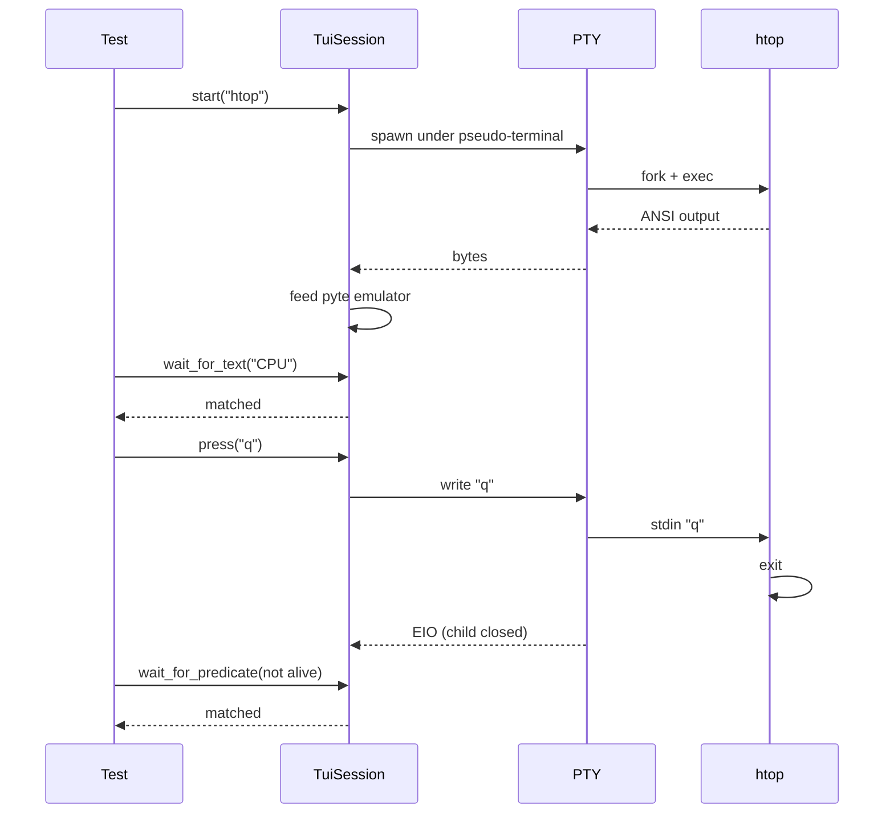

# Quickstart

Five minutes to your first passing test.

## 1. Pick a TUI to test

Anything that draws to the terminal works. We'll use the `htop` binary
as an example because it's tiny and ships everywhere. Replace with
your own.

```bash
which htop || brew install htop || apt-get install htop
```

## 2. Initialise a test project

=== "uv (recommended)"

    ```bash
    mkdir tui-tests && cd tui-tests
    uv init --no-readme
    uv add --dev tuiwright pytest pytest-asyncio
    ```

=== "pip + venv"

    ```bash
    mkdir tui-tests && cd tui-tests
    python -m venv .venv
    source .venv/bin/activate
    pip install tuiwright pytest pytest-asyncio
    ```

Configure pytest for async mode in `pyproject.toml`:

```toml
[tool.pytest.ini_options]
asyncio_mode = "auto"
asyncio_default_fixture_loop_scope = "function"
```

## 3. Write your first test

```python title="tests/test_htop.py"
import pytest
from tuiwright import TuiSession

pytestmark = pytest.mark.asyncio


async def test_htop_renders_header(tui: TuiSession) -> None:
    await tui.start("htop", cols=120, rows=40)
    await tui.wait_for_text("CPU", timeout=5)
    await tui.wait_for_text("Mem", timeout=5)
    assert tui.alive


async def test_htop_quits_on_q(tui: TuiSession) -> None:
    await tui.start("htop", cols=80, rows=24)
    await tui.wait_for_text("CPU")
    await tui.press("q")
    await tui.wait_for_predicate(
        lambda _: not tui.alive,
        timeout=2,
        description="htop exit",
    )
```

## 4. Run it

```bash
uv run pytest -v
```

You should see:

```
tests/test_htop.py::test_htop_renders_header PASSED
tests/test_htop.py::test_htop_quits_on_q     PASSED
```

## 5. Add a snapshot

Snapshots freeze the rendered screen so future changes show up as a
reviewable diff.

```python title="tests/test_htop_layout.py"
import pytest
from syrupy.assertion import SnapshotAssertion
from tuiwright import TuiSession
from tuiwright._snapshot import ScreenSnapshotExtension

pytestmark = pytest.mark.asyncio


async def test_htop_initial_layout(
    tui: TuiSession, snapshot: SnapshotAssertion
) -> None:
    await tui.start("htop", cols=120, rows=30)
    await tui.wait_for_text("CPU")
    await tui.wait_for_stable(quiet_ms=200)
    assert tui.screen == snapshot(extension_class=ScreenSnapshotExtension)
```

First run — create the snapshot:

```bash
uv run pytest --snapshot-update
```

Then commit the generated `.screen` file under `tests/__snapshots__/`.
Subsequent runs check against it.

## What's happening under the hood



## Next steps

- Build a [Hello, TUI](hello-tui.md) demo from scratch
- Understand [why we never use `sleep()`](concepts/waiting.md)
- Learn the [full key syntax](input/keys.md)
- Add [PNG regression](snapshots/png.md) to catch colour bugs
