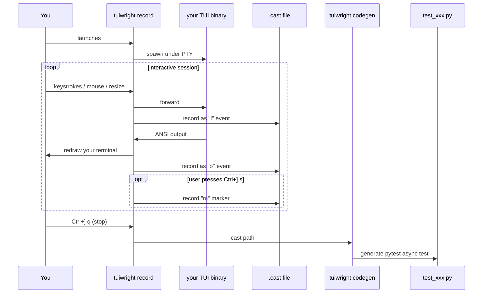

# Record & generate

`tuiwright record` is a wrapper that lets you drive a TUI interactively
while everything you do is recorded. `tuiwright codegen` turns that
recording into a pytest test that codifies exactly what you just
demonstrated.

The workflow is "do it once, capture forever":

```bash
# 1. record a session
tuiwright record --output tests/test_save_flow.py myapp

# 2. tests/test_save_flow.py now contains:
async def test_recorded(tui, snapshot):
    await tui.start("myapp", cols=120, rows=40)
    await tui.wait_for_text("Ready")
    await tui.type("hello")
    await tui.wait_for_text("typed: hello")
    await tui.press("ctrl+s")
    await tui.wait_for_text("Saved")
    assert tui.screen == snapshot(extension_class=ScreenSnapshotExtension, name="after-save")
    ...
```

## Workflow



## `tuiwright record`

```
tuiwright record [-c CAST] [-o TEST] [--test-name NAME] [--style {coarse,faithful,hybrid}]
                 [--settle-ms N] CMD [ARGS...]
```

| Flag | Default | Purpose |
|---|---|---|
| `-c, --cast PATH` | `./session-<timestamp>.cast` | Where to write the recording |
| `-o, --output PATH` | not generated | Also write a pytest test here on exit |
| `--test-name NAME` | `test_recorded` | Function name for the generated test |
| `--style` | `coarse` | `coarse` (collapsed, readable), `faithful` (one call per keystroke), `hybrid` (text collapsed, keys faithful) |
| `--settle-ms N` | `120` | Output silence (ms) that counts as "settled" |
| `CMD [ARGS...]` | — | The TUI command to record (use `--` if the first arg starts with `-`) |

### Hotkey menu (Ctrl+])

While recording, press <kbd>Ctrl</kbd>+<kbd>]</kbd> then:

| Key | What |
|---|---|
| `s` | Insert a snapshot marker — codegen will emit a snapshot assertion here |
| `l` | Insert a labeled marker — type the label, press Enter |
| `q` | Stop recording cleanly (also: when the child exits) |
| `?` | Show this menu (rendered on stderr) |

Anything else cancels the menu silently. The hotkey bytes themselves
are **never forwarded** to the TUI under test, so they're safe to use
even if the app captures `Ctrl+]` itself.

### What's recorded

Standard asciinema v2 cast format with our usage:

```
{"version":2,"width":120,"height":40,"title":"myapp"}
[0.000123, "o", "Ready (q to quit)\r\n"]
[0.512456, "i", "hello"]
[0.612789, "o", "typed: hello\r\n"]
[1.012345, "i", ""]
[1.112678, "o", "Saved\r\n"]
[1.512000, "m", "after-save"]
```

The cast is plain JSON-lines — you can `cat` it, edit it, replay it
with `asciinema play`, or render it to GIF with
[`agg`](https://github.com/asciinema/agg).

## `tuiwright codegen`

Run codegen separately if you'd rather record first, decide what to
generate later:

```
tuiwright codegen -i SESSION.cast -o tests/test_x.py [--test-name NAME]
                  [--style {coarse,faithful,hybrid}] [--settle-ms N]
                  [--cmd "myapp --flag"] [--cols N] [--rows N]
```

Same flags as `record`. `--cmd`, `--cols`, `--rows` let you override
what the generated test will spawn — useful if you recorded against a
binary at one path but the test should target another.

### How codegen decides on waits

For every input event in the cast, codegen looks at the output that
arrived since the previous input and picks one of:

| Output state | Emitted wait |
|---|---|
| Distinctive new text appeared | `await tui.wait_for_text("<that text>")` |
| Output changed but no clean candidate | `await tui.wait_for_stable(quiet_ms=N)` |
| No output at all | `await tui.wait_for_stable(quiet_ms=N)` |

The heuristic for "distinctive new text" prefers short alphanumeric
phrases (3-40 chars) that don't appear in the prior screen. Tests
generated this way are **deterministic** — they wait for the same
effect we observed during recording.

### Styles

=== "coarse (default)"

    Most readable. Collapses runs of printable chars into one `type()`,
    uses named keys (`"enter"` not `"\r"`), uses friendly mouse calls
    (`tui.click(row=5, col=10)`).

    ```python
    await tui.type("hello world")
    await tui.press("ctrl+s")
    await tui.click(row=5, col=10)
    ```

=== "faithful"

    One Python call per recorded keystroke. Easier to understand
    causality; tests get long fast.

    ```python
    await tui.press("h")
    await tui.press("e")
    await tui.press("l")
    await tui.press("l")
    await tui.press("o")
    ```

=== "hybrid"

    Plain text collapsed, but every special key, mouse event, and
    modifier as its own call. Best for editing-after-recording.

## `tuiwright replay`

Re-runs a recorded cast against a fresh spawn, preserving the original
input timing. No assertions — useful for demos or for verifying that
your recording reproduces the behaviour you intended.

```
tuiwright replay SESSION.cast [--cmd "override"] [--speed 2.0]
```

## When recording is the right tool

| Scenario | Use recording? |
|---|---|
| You're learning the framework and want to see what a test looks like | yes, great way to bootstrap |
| You found a bug interactively and want to lock in a regression | yes, fastest path |
| You're writing tests against a moving target (UI still evolving) | maybe — expect to re-record after every change |
| You want exact, minimal tests covering one specific contract | no — write by hand |
| You need negative tests (assert something *doesn't* appear) | no — write by hand |

Recordings are great starts; the generated tests are checked in as
Python that you own and can edit. Re-run codegen anytime to refresh
the baseline.

## Limitations

- The bridge requires a real terminal (TTY). It won't work inside a
  pipe or a non-interactive CI runner — record locally, then ship the
  generated tests.
- The hotkey defaults to <kbd>Ctrl</kbd>+<kbd>]</kbd>. If your TUI
  uses that combination for something important, [open an
  issue](https://github.com/PandelisZ/tuiwright/issues) — a
  configurable hotkey is on the roadmap.
- Some highly dynamic TUIs (those with idle redraws, blinking
  cursors, etc) can cause the "wait for text" heuristic to pick
  unstable strings. Re-record or hand-edit the generated test in
  those cases.
- macOS and Linux only (matches the rest of the framework).

## Worked example

The full demo from start to finish:

```bash
# Build the gode binary (or use any TUI)
cd /path/to/gode && cargo build --release -p roder-cli

# Record a session
cd /path/to/tests
tuiwright record \
    -o tests/test_gode_recorded.py \
    --test-name test_settings_modal \
    target/release/gode
```

In the recorded session:

1. Wait for the composer to appear.
2. Press <kbd>Ctrl</kbd>+<kbd>P</kbd> to open the Settings modal.
3. Press <kbd>Ctrl</kbd>+<kbd>]</kbd> then `s` to snapshot the modal.
4. Press <kbd>Escape</kbd> to close.
5. Press <kbd>Ctrl</kbd>+<kbd>]</kbd> then `q` to stop recording.

Result:

```python
async def test_settings_modal(tui, snapshot):
    await tui.start(["target/release/gode"], cols=140, rows=44)
    await tui.wait_for_text("Ask gode to work on this repo")
    await tui.press("ctrl+p")
    await tui.wait_for_text("Settings")
    await tui.wait_for_stable(quiet_ms=120)
    assert tui.screen == snapshot(extension_class=ScreenSnapshotExtension, name="snapshot")
    await tui.press("escape")
    await tui.wait_for_stable(quiet_ms=120)
```

Add it to your test suite and commit.

Next: [Pytest fixtures →](pytest/fixtures.md)
