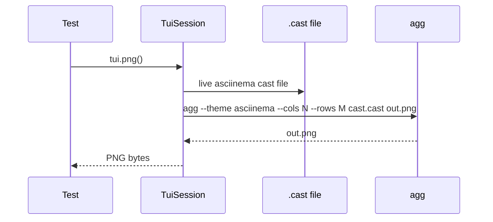

# PNG snapshots

PNG snapshots render the live asciinema cast through
[`agg`](https://github.com/asciinema/agg) and compare with
[`pixelmatch`](https://github.com/whtsky/pixelmatch-py). They catch
pixel-level regressions that cell-grid snapshots can miss: font
metric changes, anti-aliasing, ambiguous-width character rendering.

!!! info "Prerequisite"

    PNG snapshots require the `agg` binary on `PATH`.

    ```bash
    brew install agg                              # macOS
    cargo install --git https://github.com/asciinema/agg
    ```

    Without `agg`, PNG assertions raise `FileNotFoundError` with a
    pointer to this page. Cell-grid snapshots keep working.

## Quick start

```python
import pytest
from syrupy.assertion import SnapshotAssertion
from tuiwright import TuiSession
from tuiwright._snapshot import PNGSnapshotExtension

pytestmark = pytest.mark.asyncio


async def test_layout_png(tui: TuiSession, snapshot: SnapshotAssertion):
    await tui.start("myapp", cols=120, rows=30)
    await tui.wait_for_text("Ready")
    await tui.wait_for_stable(quiet_ms=200)

    png = tui.png()
    assert png == snapshot(extension_class=PNGSnapshotExtension)
```

First run creates the PNG snapshot:

```bash
pytest --snapshot-update
```

Files land as `<test_name>.png` under `tests/__snapshots__/<test_module>/`.

## How rendering works



Every session records to a `.cast` file (asciinema v2 format). When
you call `tui.png()`, the framework invokes `agg` on the current cast
to render the latest frame.

## Comparison

Two PNGs are considered equal if:

1. Their bytes are identical (fast path), or
2. They have the same dimensions and `pixelmatch` finds **zero
   mismatched pixels** with the configured threshold.

The default threshold (`0.1`) allows minor anti-aliasing differences
that don't affect the visible content. Increase tolerance for tests
that run across different platforms:

```python
class TolerantPNG(PNGSnapshotExtension):
    threshold = 0.3
    include_anti_alias = False
```

## On mismatch

When the PNG doesn't match, the framework writes three files
alongside the snapshot:

```
tests/__snapshots__/test_layout/
├── test_layout_png.png             # the committed expected
├── test_layout_png.actual.png      # what the test produced this run
└── test_layout_png.diff.png        # pixel-level diff highlight
```

`.actual.png` and `.diff.png` are git-ignored by default. Open them in
any image viewer to see exactly what changed.

## When to use PNG

Cell-grid snapshots are cheaper and easier to review — use them as
the default. Reach for PNG when:

- You're testing **glyph rendering** (custom fonts, sixel images,
  ligatures).
- You're testing **colour fidelity** in a way that goes beyond the
  cell attrs (gradients, true-colour transitions).
- You're testing **alignment** at sub-cell precision (rare).
- You want **demo screenshots** that double as regression tests.

Most projects use PNG for one or two "this is the canonical view"
snapshots and cell-grid for the rest.

## Performance

PNG rendering is slower than cell-grid:

| Op | Typical time |
|---|---|
| Cell-grid snapshot capture | <1 ms |
| Cell-grid comparison | <1 ms |
| PNG render via `agg` | 50-200 ms |
| PNG comparison (pixelmatch) | 5-30 ms |

For a CI suite with many snapshot tests, keep PNGs to the handful
that benefit from pixel-level checking. Use cell-grid for the rest.

## Theming

`agg` supports several built-in themes. Pass via `tui.png()`:

```python
png = tui.png(theme="dracula")
```

| Theme | Use |
|---|---|
| `asciinema` (default) | Neutral mid-grey background |
| `monokai` | High-contrast for screenshots |
| `dracula` | Dark with vivid accent colours |
| `solarized-dark` / `solarized-light` | Easy on the eyes |
| `nord` | Cool muted palette |

Themes are baked into the rendered PNG — match the theme you use for
demo screenshots so they double as regression baselines.

## CI considerations

- **Install `agg` in CI.** Add it to your workflow:
  ```yaml
  - run: cargo install --git https://github.com/asciinema/agg
  ```
- **Pin a font.** `agg` uses a bundled font by default; if you supply
  `--font-family`, it must be the same across local and CI. Stick
  with the default unless you have a strong reason.
- **Save artifacts on failure.** Upload the `.actual.png` and
  `.diff.png` so failures are diagnosable from the CI logs:
  ```yaml
  - uses: actions/upload-artifact@v4
    if: failure()
    with:
      name: snapshot-diffs
      path: tests/__snapshots__/**/*.{actual,diff}.png
  ```

Next: [Pytest fixtures →](../pytest/fixtures.md)
